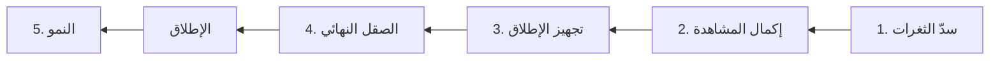

<!-- نسخة احتياطية من المستند الحيّ "خطة جزم للمرحلة القادمة"
     الأصل (يُحدَّث أولاً): https://claude.ai/artifact/FArHCwFjm6quiTRMmRavoe
     يُعاد توليد هذا الملف مع كل دفعة. آخر مزامنة: 2026-09-21 (v35.6) -->

# خطة جزم للمرحلة القادمة

**آخر مزامنة مع المستند: 2026-09-21 (v35.6)** · نسخة احتياطية — المستند الحيّ هو الأصل

الترتيب: نسدّ الثغرات أولاً، ثم نكمل المشاهدة، ثم نجهّز للإطلاق، والصقل في الآخر. كل دفعة يفحصها المحاكي قبل التسليم، وأنت تجرّب فقط ما لا يراه.

## الصورة الكاملة

v35.6 جاهزة للرفع، وفيها الخطوة 1.6. والخطوات 1.1 و1.2 و1.4 و1.5 منجزة ومجرّبة.

لا ننتقل لمرحلة قبل أن تُغلق التي قبلها بتجربتك.

**المكتمل والمجرَّب حتى الآن:**

- اللعب أونلاين ثنائي وجماعي (2–4 لاعبين) مع الساعة المركزية (بنك الوقت) والأدوات.
- المطابقة العشوائية الجماعية مع التصويت، والغرفة بالكود مع وراثة المضيف.
- الانقطاع ومهلة السماح (10 ثوانٍ)، ومؤشر الحضور وآخر ظهور.
- المشاهدة، المرحلة 1: المشاهدة بالكود، عدّاد المشاهدين، زر الكتم.
- المحاكي متعدد اللاعبين (tests/sim): 26 سيناريو، و3 مستكشفات عشوائية، وفحوص نافذة نهاية المباراة.

## المرحلة 1 — سدّ الثغرات

أولاً نغلق الثغرات التي كشفها المحاكي، كل واحدة بدفعة مستقلة.

| الخطوة | ماذا ولماذا | الخطورة | الفحص | الحالة |
| --- | --- | --- | --- | --- |
| 1.1 رفع v35.2 | تصليح زر البدء عند غير المضيف بالغرفة بالكود، وتوسعة المحاكي | منخفضة | المحاكي: كله ناجح. أنت: المضيف يخرج ويعود (بلا زر بدء)، وبحث وحيد مع تبويب بالخلفية دقيقتين | منجز |
| 1.2 إغلاق المنشئ لتبويبه في اللوبي | إغلاق التبويب أو تحديثه أو انقطاع شبكته يحذف الغرفة: بالعشوائي يُطرد الباقون، وبالكود يعلقون بلا إشعار. الحل: يُزال المنشئ وحده ويُورَّث المضيف | متوسطة | المحاكي: اختباراتها "المعروفة" تصير ناجحة. أنت: إغلاق تبويب المنشئ وتحديث صفحته، بالنوعين | منجز |
| 1.3 انضمام ثنائي محمي | لاعبان يبحثان بنفس اللحظة يدخلان على نفس المنتظر، والإلغاء لحظة الانضمام يترك غرفة فارغة ويسحب المُلغي لمباراة | متوسطة | المحاكي: يغطيها كلها (صعبة يدوياً). أنت: جولة ثنائي عادية فقط | التالي |
| 1.4 نص زر البدء بالغرفة بالكود | العدد المختار حدّ أقصى لا شرط (قرارك بعد فحص v35.4). الزر يقول "ابدأ بلاعبَين (من 3)" بعدد ناقص، و"ابدأ المباراة" مع "اكتمل العدد" عند الاكتمال | منخفضة | المحاكي: نص الزر والجملة تحته بالحالتين. أنت: نظرة على النص | منجز |
| 1.5 نافذة نهاية المباراة: الغائب وإحصائياتك | كشفها فحصاك 3 و4: المقعد الفارغ ظهر في النتيجة باسم "لاعب 1" برصيد 0، وإحصائيات كل الأجهزة كانت تُحسب للمقعد 1. ومعها: المشاهد تُسجَّل عليه خسارة ويكسب جواهر المقعد 1، وشارة المستوى على بطاقة غير صاحبها. الحل: النتيجة من مصدر واحد (من لعب فعلاً + مقعدك أنت) | منخفضة | المحاكي: فحوص جديدة لنافذة النهاية (37 تأكيداً، وعلى v35.4 تعيد الخلل حرفياً). أنت: غرفة غادرها منشئها قبل البدء، ومباراة جماعية يفوز فيها غير المقعد 1 | منجز |
| 1.6 تسجيل نهايات الانسحاب | الفوز بانسحاب الخصوم يعرض رسالة فقط: لا فوز يُسجَّل ولا خبرة، وعملات الجواهر من المباراة تضيع. والمنسحب بالزر لا تُسجَّل عليه خسارة. الحل: كل النهايات تمرّ على نافذة النتيجة | متوسطة | المحاكي: 7 سيناريوهات جديدة (انسحاب، إغلاق تبويب، انقطاع حقيقي لكل طرف، انقطاع طويل، مباراة ثانية، آخر الباقين، ختم انقطاع متأخر) وفحوص النافذة، ومراجعتان مستقلتان. أنت: انسحاب بالزر بالثنائي، وإغلاق تبويب الخصم، وآخر الباقين بالجماعي | جاهز للرفع |

فحوصك الأربعة على v35.4 ثبّتت 1.1 و1.2، وكشفت خللي نافذة النهاية (1.5)، وتتبّعهما كشف 1.6. ترتيب التنفيذ: v35.5 (1.4 و1.5)، ثم v35.6 (1.6)، ثم v35.7 (1.3). بعد 1.3 تختفي كل الأخطاء "المعروفة" من تقرير المحاكي.

## المرحلة 2 — إكمال المشاهدة

الهدف: مشاهدة أي مباراة بنقرة واحدة، بلا أكواد. المحرّك جاهز من المرحلة 1، وتبقى الواجهة والفهرسة.

| الخطوة | ماذا ولماذا | الخطورة | الفحص | الحالة |
| --- | --- | --- | --- | --- |
| 2.1 عدّاد المشاهدين وزر الكتم | يراه اللاعبون والمشاهدون | — | مُجرَّب | منجز |
| 2.2 حالة "يشاهد مباراة" | حالة خامسة في مؤشر الحضور يراها أصدقاؤك | منخفضة | المحاكي لا يغطي الحضور. أنت: صديق يشاهد ← تظهر حالته عندك | لاحقاً |
| 2.3 زر "شاهد" بجانب الصديق | الصديق الذي حالته "في مباراة" تدخل مباراته بنقرة (نحفظ كود غرفته مع حالته) | منخفضة–متوسطة | المحاكي: نضيف له دخول المشاهد وخروجه. أنت: الدخول بنقرة، شكل اللوحة، الخروج | لاحقاً |
| 2.4 قائمة المباريات العامة | فهرس للمباريات الجارية وشاشة اختيار. الترتيب: الأصدقاء، ثم الأكثر مشاهدة، ثم الأحدث | متوسطة | المحاكي: نضيف الفهرسة. أنت: الشكل والترتيب والدخول | لاحقاً |
| 2.5 إزالة زر "شاهد بالكود" | كان مدخل اختبار مؤقتاً؛ الكود يبقى للانضمام كلاعب | منخفضة | أنت: نظرة سريعة | لاحقاً |

المشاهدة متاحة للجميع حتى الضيف، وخيارات الخصوصية مؤجّلة للمرحلة 5. فهرس 2.4 نصمّمه بحيث يخدم أداء البحث أيضاً (3.2).

## المرحلة 3 — تجهيز الإطلاق

قبل فتح اللعبة للناس نقوّي الأساس: منطق المطابقة، والأداء، والأمان.

| الخطوة | ماذا ولماذا | الخطورة | الفحص | الحالة |
| --- | --- | --- | --- | --- |
| 3.1 مطابقة بمراحل واضحة | تجميع ← تصويت ← بدء بدل قرارات موزّعة على الأجهزة، فتقلّ الحالات النادرة. ترتيب للكود الموجود لا كتابة من جديد | عالية (يحميها المحاكي) | المحاكي: أساسي، كل الفحوص تنجح. أنت: جولة عامة | لاحقاً |
| 3.2 أداء البحث | كل بحث (ثنائي وجماعي) يقرأ كل الغرف بما فيها سجلات حركات المباريات، فيبطؤ ويكلف مع الكثرة. الحل: فهرس خفيف للغرف المفتوحة. ومعه: غرف الثنائي بعد النهاية الطبيعية تبقى "جارية" حتى تنظيف الساعة (منذ v35.6)، الحل: حالة "انتهت طبيعياً" مستقلة تُنظَّف فوراً | متوسطة | المحاكي: نعم. أنت: جولة عامة | بانتظار قرارك |
| 3.3 مراجعة قواعد أمان Firebase | من يستطيع قراءة وكتابة ماذا؛ ضرورية قبل فتح اللعبة للناس | متوسطة | المحاكي: لا. أنت: الشاشات الأساسية بعدها | بانتظار قرارك |
| 3.4 إعلان نفاد الوقت من مصدر واحد | اليوم كل جهاز يعلن النفاد بنفسه، فقد يسبق جهازٌ غيرَه بلحظة عند النهاية بالوقت (موثّق) | منخفضة | أنت: مباراة تنتهي بالوقت على جهازين | لاحقاً |
| 3.5 توحيد مستمعي الحركات | للثنائي والجماعي مستمعان متشابهان؛ تنظيف يسهّل الصيانة (غير عاجل) | منخفضة | أنت: مباراة ثنائي وأخرى جماعية | لاحقاً |
| 3.6 مهلة سماح للثنائي | الثنائي ينتهي فوراً عند أي انقطاع حتى لو لحظياً، والجماعي ينتظر 10 ثوانٍ. توحيدهما يمنع خسارة مباراة بانقطاع عابر، وبعده نسجّل خسارة من لم يعد | متوسطة | المحاكي: انقطاع عابر وإغلاق تبويب. أنت: قطع الشبكة ثوانٍ أثناء مباراة | بانتظار قرارك |
| 3.7 حماية الخبرة من الانسحاب المتفق عليه | منذ v35.6 الفوز بانسحاب الخصم يعطي خبرة كاملة، فيستطيع حسابان تبادل الانسحاب الفوري لجمع خبرة وانتصارات. اقتراح: خبرة فوز الانسحاب فقط إذا لُعب نصف اللوحة على الأقل | منخفضة | المحاكي: فحوص النافذة. أنت: انسحاب مبكر ومتأخر | بانتظار قرارك |

3.2 و3.3 إضافتان جديدتان مني لم نناقشهما بعد، لذلك حالتهما "بانتظار قرارك".

## المرحلة 4 — الصقل النهائي

الصقل آخر شيء، مثل بوليش السيارة: شكل فقط بلا تغيير في المنطق، وكله تجرّبه أنت بعينك.

| البند | التفاصيل | الحالة |
| --- | --- | --- |
| شاشة الإعدادات | لمسات نهائية | لاحقاً |
| شكل الجوهرة | توحيد شكلها بين اللوحة والأيقونات | لاحقاً |
| نافذة تأكيد مخصّصة | بدل نافذة المتصفح عند الانسحاب، بدالة عامة تُستعمل في كل مكان، مع تحسين شكل الإشعارات | لاحقاً |
| لون نص الدور | يتلوّن بلون صاحب الدور بدل التركوازي الثابت | لاحقاً |
| بطاقة اللاعب الخارج | بلا شطب. نجرّب 4 بدائل جنب بعض (شارة وحدها، إطار متقطع، رمز باب، شريط جانبي) + فكرة الشريط المصغّر | بانتظار قرارك |
| ظهور لوحة المشاهد | اللوحة تظهر قبل خطوطها بأقل من ثانية؛ نجرّب بناءها خارج الشاشة ثم إظهارها جاهزة | لاحقاً |
| حالة "خامل" + "الظهور كغير متصل" | لمن يترك اللعبة مفتوحة بلا استعمال، وخيار خصوصية بالإعدادات | لاحقاً |
| عدّاد تصاعدي لمدة البحث (اختياري) | للاعب الوحيد: كم صار له يبحث، بلا إيحاء بحدث عند الصفر | بانتظار قرارك |
| رسومات موحّدة بدل الإيموجي (اختياري) | شكل الإيموجي يختلف بين الأجهزة؛ الرسومات توحّده وتعطي هوية مميّزة | بانتظار قرارك |

## المرحلة 5 — النمو بعد الإطلاق

بعد الإطلاق نبني حسب ما يحتاجه اللاعبون فعلاً؛ لكل فكرة شرط يحدّد وقتها.

| الفكرة | متى |
| --- | --- |
| البطولات | بعد الإطلاق، بدءاً ببطولة أصدقاء خاصة (لا تحتاج قاعدة لاعبين كبيرة) |
| الاقتصاد الكامل: جواهر، متجر، إعلانات مكافأة، شراء + لوحة التحكم | بعد الإطلاق |
| ربح المشاهدة: إعلان قبل المشاهدة أولاً، ثم التشجيع المدفوع | بعد الاقتصاد |
| تفاعل المشاهدين: تشجيع بالإيموجي ودردشة، بلا تأثير على النتيجة | بعد قائمة المباريات العامة |
| خصوصية المباراة: عامة / أصدقاء / مغلقة | بعد قائمة المباريات العامة |
| إعادة المباريات ومشاركة رابطها | بعد اكتمال المشاهدة |
| الغرف المتعددة للمطابقة | عندما يتكرر انتظار لاعبين عددهم يكفي لمباراة (مؤشر في لوحة التحكم) |
| الجمهور الشخصي لكل لاعب | مع البطولات وهوية اللاعبين |
| نظام سمعة وعقوبات للانسحاب | مع المطابقة التنافسية |
| ذكاء آلة "خارق" (نظرية السلاسل) | مشروع منفصل، أي وقت |
| توزيع العناصر الذكي، البيئات المتعددة، أدوات جديدة | بمعيار "قليل ومتقن" |
| تطبيق iOS وAndroid | المرحلة الأخيرة |

## ماذا يغطي المحاكي وماذا تجرّب أنت

المحاكي يغطي منطق الغرف والمطابقة كاملاً؛ أنت تجرّب ما تراه العين وما يحدث داخل المباراة.

| المجال | المحاكي | أنت |
| --- | --- | --- |
| البحث الجماعي: تجميع، تصويت، رفض، رجوع، منتظرون، بدء | يغطيه كاملاً | لا داعي، إلا شكل الشاشات |
| 4 لاعبين | يغطيه | لا داعي |
| الغرفة بالكود: التاج، الوراثة، المقاعد، البدء، الامتلاء | يغطيه | لا داعي |
| البحث الثنائي: الانتظار، البدء، الإلغاء | يغطيه | لا داعي |
| الشكل والإحساس: نصوص، ألوان، وميض، ترتيب | لا | نعم |
| المتصفح الحقيقي: تبويب بالخلفية، تحديث الصفحة، الموبايل | لا | نعم |
| الشبكة الحقيقية: بطء، انقطاع، مهلة السماح | جزئياً (إغلاق تبويب وانقطاع عابر) | نعم |
| داخل المباراة: اللوحة، الأدوار، الساعة، الأدوات، النقاط، النهاية | جزئياً: نافذة النهاية (الترتيب وما يُسجَّل) ونهايات الانسحاب منذ v35.5–v35.6. اللوحة والأدوار والساعة لا | نعم |
| المشاهدة | ليس بعد (نضيفها مع المرحلة 2) | نعم |
| الحضور، الأصدقاء، الدعوات، الدردشة | لا | نعم |
| ضد الكمبيوتر واللعب المحلي | لا | نعم |

بعد كل دفعة أرسل لك قائمة قصيرة فيها فقط ما يخصّ تلك الدفعة من عمود "أنت". وكلما زادت تغطية المحاكي يتحدّث هذا الجدول.

## طريقة الشغل في كل دفعة

كل خطوة في الجداول أعلاه تمرّ بنفس الدورة الست:

1. أعدّل الكود بدفعة صغيرة؛ الخطير يكون وحده حتى نعرف مصدر أي عطل.
2. أشغّل المحاكي؛ لا تسليم إلا إذا نجح كله.
3. أوثّق التغيير في IDEAS.md.
4. أسلّمك الحزمة "جاهزة للرفع" مع قائمة تجربة قصيرة.
5. ترفعها عبر GitHub Desktop وتجرّب القائمة.
6. ترسل لي النتيجة، فنحدّث الحالة هنا وننتقل للخطوة التالية.

قاعدتان ثابتتان: عندما تقول "سجّل بس" أوثّق بلا تعديل، وأي فكرة جديدة تُضاف لهذه الخطة قبل تنفيذها.
